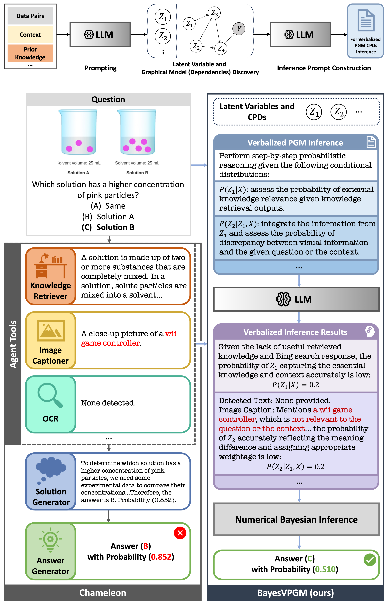

<h1 align="center">
BayesAgent: Bayesian Agentic Reasoning Under Uncertainty via Verbalized Probabilistic Graphical Modeling
</h1>

<p align="center">
  <a href="https://arxiv.org/abs/2406.05516"></a>
  <a href="https://www.python.org/"></a>
  <a href="https://pytorch.org/"></a>
  <a href="https://docs.vllm.ai/en/v0.9.1/"></a>
</p>

This repository contains the official implementation of the paper:
> __BayesAgent: Bayesian Agentic Reasoning Under Uncertainty via Verbalized Probabilistic Graphical Modeling__  
> [Hengguan Huang*](https://scholar.google.com/citations?hl=en&user=GQm1eZEAAAAJ), [Xing Shen*](https://scholar.google.com/citations?hl=en&user=U69NqfQAAAAJ), Guang-Yuan Hao, Songtao Wang, Lingfa Meng, Dianbo Liu, David Alejandro Duchene, Hao Wang, Samir Bhatt  
> _*Equal contribution_  
> _AAAI Conference on Artificial Intelligence, 2026_  
> __Paper ([arXiv preprint](https://arxiv.org/abs/2406.05516))__

The technical appendix can be found at [here](./assets/appendix.pdf).


## Overview
In this work, we explore for the first time how to bridge LLM agents with probabilistic graphical models (PGMs) to address agentic reasoning under uncertainty. To this end, we introduce Verbalized Probabilistic Graphical Modeling (vPGM), a Bayesian agentic framework that (i) guides LLM agents in following key principles of PGMs through natural language and (ii) refines the resulting posterior distributions via numerical Bayesian inference. Unlike many traditional probabilistic methods requiring substantial domain expertise, vPGM bypasses expert‐driven model design, making it well‐suited for scenarios with limited assumptions.
<p align="center" style="line-height:0;">
  
</p>

## 1. Preparation

### 1.1 Installation
It is recommended to use a virtual environment (e.g., `venv`) to avoid package conflicts. Here we assume you are using `venv` as your virtual environment. If you are using conda, please adjust the commands accordingly.
```bash
git clone https://github.com/xingbpshen/agentic-reasoning-vpgm.git
cd agentic-reasoning-vpgm/
pip install -r requirements.txt
```

### 1.2 Preparing the Dataset
The downloaded dataset should be structured in the following format, the `datasets/` directory should be placed at the root of the repository:
```
datasets/
└── my_scienceqa/
    ├── val_1005.json
    ├── test_2563.json
    └── DATASET_LICENSE
```
This dataset is a subset, and a processed (all tools' responses are included) version of the original [ScienceQA](https://github.com/lupantech/ScienceQA) dataset. For convenience, we provide a [Google Drive link](https://drive.google.com/drive/folders/1OFah-mLXufy8XbUq6B5_JNepeS_S_Yy-?usp=sharing) to download the processed dataset used in our experiments, note that the dataset is under CC BY-NC-SA 4.0 license.

## 2. Running Inference
Please run the following command to run inference:
```bash
bash auto_run.sh
```
The inference results file will be saved in the specified path `results/` under the project root.

## Acknowledgments
S.B. acknowledges funding from the MRC Centre for Global Infectious Disease Analysis (reference MR/X020258/1), funded by the UK Medical Research Council (MRC). This UK funded award is carried out in the frame of the Global Health EDCTP3 Joint Undertaking. S.B. is funded by the National Institute for Health and Care Research (NIHR) Health Protection Research Unit in Modelling and Health Economics, a partnership between UK Health Security Agency, Imperial College London and LSHTM (grant code NIHR200908). H.W. is partially supported by Amazon Faculty Research Award, Microsoft AI & Society Fellowship, NSF CAREER Award IIS-2340125, NIH grant R01CA297832, and NSF grant IIS-2127918. We acknowledge support from OpenAI’s Researcher Access Program. Disclaimer: "The views expressed are those of the author(s) and not necessarily those of the NIHR, UK Health Security Agency or the Department of Health and Social Care." S.B. acknowledges support from the Novo Nordisk Foundation via The Novo Nordisk Young Investigator Award (NNF20OC0059309). S.B. acknowledges the Danish National Research Foundation (DNRF160) through the chair grant. S.B. acknowledges support from The Eric and Wendy Schmidt Fund For Strategic Innovation via the Schmidt Polymath Award (G-22-63345) which also supports H.H. and L.M.

[//]: # (## Citation)

## Contact
Please raise a GitHub issue or email us at <a href="mailto:xing.shen@mail.mcgill.ca">xing.shen@mail.mcgill.ca</a> (with the email subject starting with "[vPGM]") if you have any question or encounter any issue.